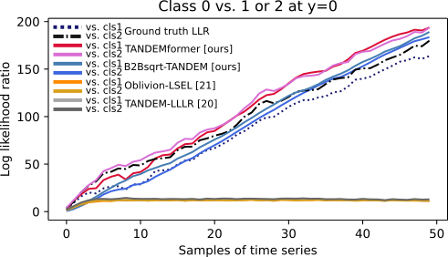

# SPRT-TANDEM-PyTorch
This repository contains the official PyTorch implementation of __SPRT-TANDEM__ ([ICASSP2023](https://arxiv.org/abs/2302.09810), [ICML2021](http://proceedings.mlr.press/v139/miyagawa21a.html), and [ICLR2021](https://openreview.net/forum?id=Rhsu5qD36cL)). __SPRT-TANDEM__ is a neuroscience-inspired sequential density ratio estimation (SDRE) algorithm that estimates log-likelihood ratios of two or more hypotheses for fast and accurate sequential data classification. For intuitive understanding, also see [SPRT-TANDEM tutorial](https://github.com/Akinori-F-Ebihara/SPRT-TANDEM_tutorial).

<div align="center">
<figure>
  

<figcaption>Figure 1: Example sequential density ratio estimation (SDRE) results on a 3-class multivariate Gaussian dataset. </figcaption>
</figure>
</div>

## Quickstart
1. Create a new SDRE dataset by running [Generate_sequential_Gaussian_as_LMDB.ipynb](https://github.com/Akinori-F-Ebihara/SPRT-TANDEM-PyTorch/blob/main/notebooks/Generate_sequential_Gaussian_as_LMDB.ipynb).
2. Edit the user editable block of [config_definition.py](https://github.com/Akinori-F-Ebihara/SPRT-TANDEM-PyTorch/blob/main/config/config_definition.py). Specify path to the dataset file created in step 1. Other frequently used entries includes SUBPROJECT_NAME_PREFIX (tag your experiment) and EXP_PHASE (try, tuning or stat. See Hyperparameter Tuning for details).
3. Execute [sprt_tandem_main.py](https://github.com/Akinori-F-Ebihara/SPRT-TANDEM-PyTorch/blob/main/sprt_tandem_main.py).

## Tested Environment
```
python      3.10.6
torch       2.0.0
notebook    6.5.3
optuna      3.1.0
```

## Supported Network Architectures  
LSTM and Transformer, the two major architectures to process time series data are supported. In order to avoid the likelihood ratio saturation problem and to approach the asymptotic optimality (for details, see [Ebihara+, ICASSP2023](https://arxiv.org/abs/2302.09810)), we invented a novel B2Bssqrt-TANDEM and TANDEMformer, based on LSTM and Transformer architectures, respectively.
### LSTM (B2Bsqrt-TANDEM, ICASSP2023)  
Long short-term memory (LSTM, 1) with the back-to-back square root (B2Bsqrt) activation function can be used to set the following variables:

- MODEL_BACKBONE: "LSTM"
- ACTIVATION_OUTPUT: "B2Bsqrt"  

Note that setting ACTIVATION_OUTPUT as "tanh" makes it a vanilla LSTM. The B2Bsqrt function is introduced in the ICASSP2023 paper for precise SDRE avoiding the likelihood ratio saturation problem:

$f_{\mathrm{B2Bsqrt}}(x) := \mathrm{sign}(x)(\sqrt{\alpha+|x|}-\sqrt{\alpha})$
### Transformer (TANDEMformer, ICASSP2023)  
Transformer is equipped with the Normalized Summation Pooling (NSP) layer. To use it, set the following variable:

- MODEL_BACKBONE: "Transformer"


## Supported Loss Functions for SDRE
SPRT-TANDEM uses both the loss for sequential likelihood ratio estimation (i.e., SDRE) and (multiplet-) cross-entropy loss ([ICLR2021](https://openreview.net/forum?id=Rhsu5qD36cL)). The two functions below are two supported loss function for SDRE:
### LSEL (ICML2021)  
$\hat{L}_{\rm \text{LSEL}} (\bm{\theta}; S) 
    := \mathbb{E} \left[ \log \left( 
        1 + \sum_{ l ( \neq k ) } e^{ - \hat{\lambda}_{k l} ( X_i^{(1,t)}; \bm{\theta} ) }
    \right) \right] $
### LLLR (ICLR2021)  

To choose the loss function, set the following variables:

- LLLR_VERSION: "LSEL" or "LLLR"

Also modify PARAM_LLR_LOSS and PARAM_MULTIPLET_LOSS for the right balance between likelihood estimation and cross-entropy loss. z

## Order N of Markov assumption
### TANDEM formula ([ICLR2021](https://openreview.net/forum?id=Rhsu5qD36cL))
$\hat{\lambda}_{kl}(X^{(1,t)}_i) =\log \left(
        \frac{p(x_i^{(1)}, ..., x_i^{(t)}| y=k)}{p(x_i^{(1)}, ..., x_i^{(t)}| y=l)}
    \right)\\
    =\sum_{s=N+1}^{t} \log \left( 
        \frac{
            p(y=k| x_i^{(s-N)}, ...,x_i^{(s)})
        }{
            p(y=l| x_i^{(s-N)}, ...,x_i^{(s)})
        }
    \right) \nonumber 
    - \sum_{s=N+2}^{t} \log \left(
        \frac{
            p(y=k| x_i^{(s-N)}, ...,x_i^{(s-1)})
        }{
            p(y=l| x_i^{(s-N)}, ...,x_i^{(s-1)})
        }
    \right) $
## Experiment Phases
EXP_PHASE must be set as one of the followings:
- try: All the hyperparameters are fixed as defined in [config_definition.py](https://github.com/Akinori-F-Ebihara/SPRT-TANDEM-PyTorch/blob/main/config/config_definition.py). Use it for debugging purposes.
- tuning: Enter into the hyperparameter tuning mode. Hyperparameters which have corresponding serch spaces defined will be overwritten with suggested parameters. Also see Hyperparameter Tuning for details.
- stat: All the hyperparameters are fixed as defined in [config_definition.py](https://github.com/Akinori-F-Ebihara/SPRT-TANDEM-PyTorch/blob/main/config/config_definition.py). Repeat trainings for the number specified with NUM_TRIALS. Use it for testing reproducibility (e.g., plot error bars, run a statistical test). 
Your subproject name will be suffixed with the EXP_PHASE, so that results from different phases do not contaminate each other.
## Hyperparameter Tuning
Optuna [1] - based hyperparameter tuning is supported. Firstly, edit the following variables in the [config_definition.py](https://github.com/Akinori-F-Ebihara/SPRT-TANDEM-PyTorch/blob/main/config/config_definition.py):
- EXP_PHASE: set as "tuning" to enter into hyperparameter tuning mode.
- NUM_TRIALS: set an integer specifying the number of hyperparameter sets to experiment.
- PRUNER_NAME (optional): select a pruner supported by Optuna, or set "None."    
also set PRUNER_STARTUP_TRIALS, PRUNER_WARMUP_STEPS, and PRUNER_INTERVAL STEPS. For details, see the [official Optuna docs](https://optuna.readthedocs.io/en/stable/reference/generated/optuna.pruners.MedianPruner.html#optuna.pruners.MedianPruner).  

Next, customize the hyperparameter space defined with variables that have prefix "LIST_". For example, [config_definition.py](https://github.com/Akinori-F-Ebihara/SPRT-TANDEM-PyTorch/blob/main/config/config_definition.py) contains an entry like this:

```
    "LIST_ORDER_SPRT": {
        "PARAM_SPACE": "int",
        "LOW": 0,
        "HIGH": 5,  # 10
        "STEP": 1,
        "LOG": False,
    }
```
The above entry specifies the search space of a hyperparameter "ORDER_SPRT." The key "PARAM_SPACE" must be one of the followings:  
 - float: use suggest_float to suggest a float of range [LOW, HIGH], separated by STEP. If LOG=True, a float is sampled from logspace but you shall set STEP=None.
 - int: use suggest_int to suggest an int of range [LOW, HIGH], separated by STEP. STEP should be divisor of the range, otherwise HIGH will be automatically modified. If LOG=True, an int is sampled from logspace but you shall set STEP=None.
 - categorical: use suggest_categorical to select one category from CATEGORY_SET. Note that if the parameter is continuous (e.g., 1, 2, 3, ..., or 1.0, 0.1, 0.001, ...), it is adviseable to use float or int space because suggest_categorical treats each category independently.

 Also see the [official Optuna docs](https://optuna.readthedocs.io/en/stable/reference/generated/optuna.trial.Trial.html). All the entries starting with "LIST_" will be used to select values, which will be set to the hyperparameter whose name is defined after "LIST_" (e.g., in the above example, "ORDER_SPRT).

## Command-line Arguments  
Frequently-used variables can be overwritten by specifying the command-line arguments. 
```
options:
  -h, --help            show this help message and exit
  -g GPU, --gpu         set GPU, gpu number
  -t NUM_TRIALS, --num_trials 
                        set NUM_TRIALS, number of trials
  -i NUM_ITER, --num_iter 
                        set NUM_ITER, number of iterations
  -e EXP_PHASE, --exp_phase EXP_PHASE
                        phase of an experiment, "try," "tuning," or "stat"
  -m MODEL, --model MODEL
                        set model backbone, "LSTM", or "Transformer"
  -o OPTIMIZE, --optimize OPTIMIZE
                        set optimization target: "MABS", "MacRec", "ausat_confmx", or "ALL"
  -n NAME, --name NAME  set the subproject name
  --flip_memory_loading
                        set a boolean flag indicating whether to load onto memory

```
## Logging
Under the [logs](https://github.com/Akinori-F-Ebihara/SPRT-TANDEM-PyTorch/blob/main/logs) folder, you will see a subfolder like this:
```
{SUBPROJECT_SUFFIX}_offset{DATA_SEPARATION}_optim{OPTIMIZATION_TARGET}_{EXP_PHASE}
```
inside which the following four folders will be created.
- Optuna_databases: Optuna .db file is stored here.
- TensorBoard_events: TensorBard event files are saved here.
- checkpoints: trained parameters are saved as .py files, when the best optimation target value is updated.
- stdout_logs: standard output strings are saved as .log files.

The plot below shows an example image saved in a TensorBoard event file. Note that you can avoid saving figures by setting IS_SAVE_FIGURE=False.
<div align="center">

</div>


## Citation
___Please cite the orignal paper(s) if you use the whole or a part of our codes.___

```
# ICASSP2023
@inproceedings{saturation_problem,
  title =     {Toward Asymptotic Optimality: Sequential Unsupervised Regression of Density Ratio for Early Classification},
  author =    {Akinori F Ebihara and Taiki Miyagawa and Kazuyuki Sakurai and Hitoshi Imaoka},
  booktitle = {IEEE International Conference on Acoustics, Speech and Signal Processing},
  year =      {2023},
}

# ICML2021
@inproceedings{MSPRT-TANDEM,
  title = 	  {The Power of Log-Sum-Exp: Sequential Density Ratio Matrix Estimation for Speed-Accuracy Optimization},
  author =    {Miyagawa, Taiki and Ebihara, Akinori F},
  booktitle = {Proceedings of the 38th International Conference on Machine Learning},
  pages = 	  {7792--7804},
  year = 	  {2021},
  url = 	  {http://proceedings.mlr.press/v139/miyagawa21a.html}
}

# ICLR2021
@inproceedings{SPRT-TANDEM,
  title={Sequential Density Ratio Estimation for Simultaneous Optimization of Speed and Accuracy},
  author={Akinori F Ebihara and Taiki Miyagawa and Kazuyuki Sakurai and Hitoshi Imaoka},
  booktitle={International Conference on Learning Representations},
  year={2021},
  url={https://openreview.net/forum?id=Rhsu5qD36cL}
}
```

## References
1. T. Akiba, S. Sano, T. Yanase, T. Ohta, and M. Koyama, “Optuna: A next-generation hyperparameter optimization framework,” in KDD, 2019, p. 2623–2631.

## Contacts
SPRT-TANDEM marks the 4th anniversory - now it become a huge project that we never imagined before. It is thus difficult for me to explain all the details of the project in this README section. Please feed free to reach me anytime for questions specific to SPRT-TANDEM.
- email: aebihara[at]nec.com
- twitter: [@non_iid](http/twitter.com/non_iid)
- GitHub issues: see the link above or click [here](https://github.com/Akinori-F-Ebihara/SPRT-TANDEM-PyTorch/issues)