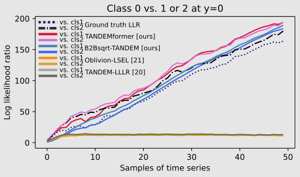

# SPRT-TANDEM-PyTorch
This repository contains the official PyTorch implementation of __SPRT-TANDEM__ ([ICASSP2023](https://arxiv.org/abs/2302.09810), [ICML2021](http://proceedings.mlr.press/v139/miyagawa21a.html), and [ICLR2021](https://openreview.net/forum?id=Rhsu5qD36cL)). __SPRT-TANDEM__ is a neuroscience-inspired sequential density ratio estimation (SDRE) algorithm that estimates log-likelihood ratios of two or more hypotheses for fast and accurate sequential data classification. For an intuitive understanding, please refer to the [SPRT-TANDEM tutorial](https://github.com/Akinori-F-Ebihara/SPRT-TANDEM_tutorial).

<div align="center">
<figure>
  
</figure>
</div>
<p align="center">Figure 1: Example sequential density ratio estimation (SDRE) results on a 3-class multivariate Gaussian dataset.</p>


## Quickstart
1. To create a new SDRE dataset, run the [Generate_sequential_Gaussian_as_LMDB.ipynb](https://github.com/Akinori-F-Ebihara/SPRT-TANDEM-PyTorch/blob/main/notebooks/Generate_sequential_Gaussian_as_LMDB.ipynb) notebook.
2. Edit the user editable block of [config_definition.py](https://github.com/Akinori-F-Ebihara/SPRT-TANDEM-PyTorch/blob/main/config/config_definition.py). Specify path to the dataset file created in step 1. Other frequently used entries include SUBPROJECT_NAME_PREFIX (to tag your experiment) and EXP_PHASE (to specify whether you are trying, tuning, or running statistics. See Hyperparameter Tuning for details).
3. Execute [sprt_tandem_main.py](https://github.com/Akinori-F-Ebihara/SPRT-TANDEM-PyTorch/blob/main/sprt_tandem_main.py).

## Tested Environment
```
python      3.10.6
torch       2.0.0
notebook    6.5.3
optuna      3.1.0
```

## Requirements for Reading This Article

This article is best read using the Chrome browser with the [MathJax Plugin for GitHub](https://chrome.google.com/webstore/detail/mathjax-plugin-for-github/ioemnmodlmafdkllaclgeombjnmnbima?hl=en) installed.

## Supported Network Architectures  
We support the two major architectures for processing time series data: LSTM and Transformer. To avoid the likelihood ratio saturation problem and approach asymptotic optimality (for details, see [Ebihara+, ICASSP2023](https://arxiv.org/abs/2302.09810)), we developed two novel models based on these architectures: B2Bssqrt-TANDEM (based on LSTM) and TANDEMformer (based on Transformer).
### LSTM (B2Bsqrt-TANDEM, [ICASSP2023](https://arxiv.org/abs/2302.09810))  
The long short-term memory (LSTM, 1) with the back-to-back square root (B2Bsqrt) activation function can be used by setting the following variables: 

- MODEL_BACKBONE: "LSTM"
- ACTIVATION_OUTPUT: "B2Bsqrt"  

It's important to note that setting ACTIVATION_OUTPUT to "tanh" will result in a vanilla LSTM. The B2Bsqrt function was introduced in the ICASSP2023 paper as a way to precisely avoid the likelihood ratio saturation problem in SDRE.  

\begin{align}
&\ f_{\mathrm{B2Bsqrt}}(x) := \mathrm{sign}(x)(\sqrt{\alpha+|x|}-\sqrt{\alpha})
\end{align}

<div align="center">
<figure>
  
</figure>
</div>
<p align="center">Figure 2: Conceptual figure showing the LSTM cell equipped with the B2Bsqrt activation function. B2Bsqrt can be used as an alternative to the tanh function. With an unbounded range and a finite gradient at the origin, B2Bsqrt prevents the saturation problem while enabling stable training.</p>


### Transformer (TANDEMformer, [ICASSP2023](https://arxiv.org/abs/2302.09810))  
The Transformer is equipped with the Normalized Summation Pooling (NSP) layer, which is incorporated by default. To use it, set the following variable:

- MODEL_BACKBONE: "Transformer"


<div align="center">
<figure>
  
</figure>
</div>
<p align="center">Figure 3: Conceptual figure illustrates the Transformer block equipped with the NSP layer. First, tokens are extracted using a sliding window and then mixed with self-attention. The normalized summation pooling layer then takes the sum of the tokens and divides them by a constant, which is the maximum size of the sliding window.</p>  

## Supported Loss Functions for SDRE
SPRT-TANDEM uses both the loss for sequential likelihood ratio estimation (SDRE) and (multiplet-) cross-entropy loss ([ICLR2021](https://openreview.net/forum?id=Rhsu5qD36cL)). The two functions, LSEL and LLLR, are supported loss function for SDRE. To choose the loss function, set the following variables:

- LLLR_VERSION: "LSEL" or "LLLR"

Additionally, modify the values of PARAM_LLR_LOSS and PARAM_MULTIPLET_LOSS to achieve the desired balance between likelihood estimation and cross-entropy loss.
### Log-sum exponential loss (LSEL, [ICML2021](http://proceedings.mlr.press/v139/miyagawa21a.html))  

\begin{align}
\hat{L}_{\mathrm{LSEL}} (\theta; S) := \mathbb{E} \left[ \log\left(1 + \sum_{l(\neq k)} e^{ - \hat{\lambda}_{k l} ( X_i^{(1,t)}; \theta) }\right)  \right]
\end{align}
  <!-- 1 + \sum_{ l ( \neq k ) } e^{ - \hat{\lambda}_{k l} ( X_i^{(1,t)}; \mathbb{\theta } ) }  -->
### Loss for log-likelihood ratio estimation (LLLR, [ICLR2021](https://openreview.net/forum?id=Rhsu5qD36cL))  

\begin{align}
\hat{L}_{\mathrm{\text{LLLR}}} (\mathbb{\theta}; S) := \mathbb{E} \left[ \left| y - \sigma\left(\log\hat{r_i}\right) \right| \right]
\end{align}

## Order N of Markov assumption
The Markov order $N$ is used to determine the length of the sliding window that extracts a subset from the entire feature vector of a time series. $N$ is a convenient hyperparameter that incorporates prior knowledge of the time series. An optimal $N$ can be found either based on the \textit{specific time scale} or through hyperparameter tuning. The specific time scale characterizes the data class, e.g., long temporal action such as UCF101 has a long specific time scale, while a spoofing attack such as SiW has a short specific time scale (because one frame can have sufficient information of the attack). Setting $N$ equal to the specific time scale usually works best. Alternatively, $N$ can be objectively chosen using a hyperparameter tuning algorithm such as Optuna, just like other hyperparameters. Because $N$ is only related to the temporal integrator after feature extraction, optimizing it is not computationally expensive.

<div align="center">
<figure>
  
</figure>
</div>
<p align="center">Figure 4: Conceptual figure showing the streamline of online SDRE. A subset of the time series' feature vectors is extracted based on the order of Markov assumption, N. </p>

The log-likelihood ratio is estimated from a subset of the feature vectors extracted using a sliding window of size $N$. This estimation is classification-based. Specifically, the temporal integrator is trained to output class logits, which are then used to update the log-likelihood ratio at each time step based on the TANDEM formula.
### TANDEM formula ([ICLR2021](https://openreview.net/forum?id=Rhsu5qD36cL))
\begin{align}
&\ \log \left(
\frac{p(x^{(1)},x^{(2)}, ..., x^{(t)}| y=1)}{p(x^{(1)},x^{(2)}, ..., x^{(t)}| y=0)}
\right)\nonumber \newline
= &\sum_{s=N+1}^{t} \log \left(
\frac{
p(y=1| x^{(s-N)}, ...,x^{(s)})
}{
p(y=0| x^{(s-N)}, ...,x^{(s)})
}
\right) - \sum_{s=N+2}^{t} \log \left(
\frac{
p(y=1| x^{(s-N)}, ...,x^{(s-1)})
}{
p(y=0| x^{(s-N)}, ...,x^{(s-1)})
}
\right) \nonumber \newline
& - \log\left( \frac{p(y=1)}{p(y=0)} \right)
\end{align}

## Experiment Phases
EXP_PHASE must be set as one of the followings:
- try: All the hyperparameters are fixed as defined in [config_definition.py](https://github.com/Akinori-F-Ebihara/SPRT-TANDEM-PyTorch/blob/main/config/config_definition.py). Use it for debugging purposes.
- tuning: Enter hyperparameter tuning mode. Hyperparameters with corresponding search spaces will be overwritten with suggested parameters. See the Hyperparameter Tuning section for more details.
- stat: All the hyperparameters are fixed as defined in [config_definition.py](https://github.com/Akinori-F-Ebihara/SPRT-TANDEM-PyTorch/blob/main/config/config_definition.py). Repeat training for the specified number of times with NUM_TRIALS to test reproducibility (e.g., plot error bars, run a statistical test). 
The subproject name will be suffixed with the EXP_PHASE to prevent contamination of results from different phases.

## Hyperparameter Tuning
Optuna [1] is supported for hyperparameter tuning. To begin, edit the following variables in the [config_definition.py](https://github.com/Akinori-F-Ebihara/SPRT-TANDEM-PyTorch/blob/main/config/config_definition.py):
- EXP_PHASE: set as "tuning" to enter hyperparameter tuning mode.
- NUM_TRIALS: set an integer that specifies the number of hyperparameter sets to experiment with.
- PRUNER_NAME (optional): select a pruner supported by Optuna, or set it to "None."    
Also, set PRUNER_STARTUP_TRIALS, PRUNER_WARMUP_STEPS, and PRUNER_INTERVAL STEPS. For details, see the [official Optuna docs](https://optuna.readthedocs.io/en/stable/reference/generated/optuna.pruners.MedianPruner.html#optuna.pruners.MedianPruner).  

Next, customize the hyperparameter space defined with variables that have prefix "LIST_". For example, [config_definition.py](https://github.com/Akinori-F-Ebihara/SPRT-TANDEM-PyTorch/blob/main/config/config_definition.py) contains an entry like this:

```
    "LIST_ORDER_SPRT": {
        "PARAM_SPACE": "int",
        "LOW": 0,
        "HIGH": 5,  # 10
        "STEP": 1,
        "LOG": False,
    }
```
The above entry specifies the search space of a hyperparameter "ORDER_SPRT." The key "PARAM_SPACE" must be one of the followings:  
 - float: use suggest_float to suggest a float of range [LOW, HIGH], separated by STEP. If LOG=True, a float is sampled from logspace. However, if LOG=True, set STEP=None.
 - int: use suggest_int to suggest an integer of range [LOW, HIGH], separated by STEP. STEP should be divisor of the range; otherwise, HIGH will be automatically modified. If LOG=True, an int is sampled from logspace. However, if LOG=True, set STEP=None.
 - categorical: use suggest_categorical to select one category from CATEGORY_SET. Note that if the parameter is continuous (e.g., 1, 2, 3, ..., or 1.0, 0.1, 0.001, ...), it is advisable to use float or int space because suggest_categorical treats each category independently.

For more informatin, please refer to the [official Optuna docs](https://optuna.readthedocs.io/en/stable/reference/generated/optuna.trial.Trial.html).   

To select specific values for a hyperparameter, use entries that start with "LIST_". These values will be assigned to the hyperparameter whose name is defined after "LIST_" (for example, in the above example, "ORDER_SPRT").

## Command-line Arguments  
Frequently-used variables can be overwritten by specifying command-line arguments. 
```
options:
  -h, --help            show this help message and exit
  -g GPU, --gpu         set GPU, gpu number
  -t NUM_TRIALS, --num_trials 
                        set NUM_TRIALS, number of trials
  -i NUM_ITER, --num_iter 
                        set NUM_ITER, number of iterations
  -e EXP_PHASE, --exp_phase EXP_PHASE
                        phase of an experiment, "try," "tuning," or "stat"
  -m MODEL, --model MODEL
                        set model backbone, "LSTM", or "Transformer"
  -o OPTIMIZE, --optimize OPTIMIZE
                        set optimization target: "MABS", "MacRec", "ausat_confmx", or "ALL"
  -n NAME, --name NAME  set the subproject name
  --flip_memory_loading
                        set a boolean flag indicating whether to load onto memory

```
## Logging
Under the [logs](https://github.com/Akinori-F-Ebihara/SPRT-TANDEM-PyTorch/blob/main/logs) folder, you will see a subfolder like this:
```
{SUBPROJECT_SUFFIX}_offset{DATA_SEPARATION}_optim{OPTIMIZATION_TARGET}_{EXP_PHASE}
```
inside of which the following four folders will be created.
- Optuna_databases: Optuna .db file is stored here.
- TensorBoard_events: TensorBard event files are saved here.
- checkpoints: trained parameters are saved as .py files when the best optimation target value is updated.
- stdout_logs: standard output strings are saved as .log files.

The plot below shows an example image saved in a TensorBoard event file. Note that you can avoid saving figures by setting IS_SAVE_FIGURE=False.

<div align="center">
<figure>
  
</figure>
</div>
<p align="center">Figure 5: Example image saved in a TensorBoard event file. (left and center) Estimated LLR trajectories and Ground-truth LLR trajectories of 3-class multidimensional Gaussian dataset. (right) Speed-accuracy tradeoff (SAT) curve calculated by running the SPRT algorithm.</p>

Note that "Class $a$ vs. $b$ at $y=a$" indicates that the plotted LLR shows $\log{p(X|y=a) / p(X|y=b)}$, when the ground truth label is $y=a$. 

## Citation
___Please cite the orignal paper(s) if you use the whole or a part of our codes.___

```
# ICASSP2023
@inproceedings{saturation_problem,
  title =     {Toward Asymptotic Optimality: Sequential Unsupervised Regression of Density Ratio for Early Classification},
  author =    {Akinori F Ebihara and Taiki Miyagawa and Kazuyuki Sakurai and Hitoshi Imaoka},
  booktitle = {IEEE International Conference on Acoustics, Speech and Signal Processing},
  year =      {2023},
}

# ICML2021
@inproceedings{MSPRT-TANDEM,
  title = 	  {The Power of Log-Sum-Exp: Sequential Density Ratio Matrix Estimation for Speed-Accuracy Optimization},
  author =    {Miyagawa, Taiki and Ebihara, Akinori F},
  booktitle = {Proceedings of the 38th International Conference on Machine Learning},
  pages = 	  {7792--7804},
  year = 	  {2021},
  url = 	  {http://proceedings.mlr.press/v139/miyagawa21a.html}
}

# ICLR2021
@inproceedings{SPRT-TANDEM,
  title={Sequential Density Ratio Estimation for Simultaneous Optimization of Speed and Accuracy},
  author={Akinori F Ebihara and Taiki Miyagawa and Kazuyuki Sakurai and Hitoshi Imaoka},
  booktitle={International Conference on Learning Representations},
  year={2021},
  url={https://openreview.net/forum?id=Rhsu5qD36cL}
}
```

## References
1. T. Akiba, S. Sano, T. Yanase, T. Ohta, and M. Koyama, “Optuna: A next-generation hyperparameter optimization framework,” in KDD, 2019, p. 2623–2631.

## Contacts
SPRT-TANDEM marks its 4th anniversary. What started as a small project has now become a huge undertaking that we never imagined. Due to its complexity, it is difficult for me to explain all the details in this README section. Please feel free to reach out to me anytime if you have any questions.
- email: aebihara[at]nec.com
- twitter: [@non_iid](http/twitter.com/non_iid)
- GitHub issues: see the link above or click [here](https://github.com/Akinori-F-Ebihara/SPRT-TANDEM-PyTorch/issues)